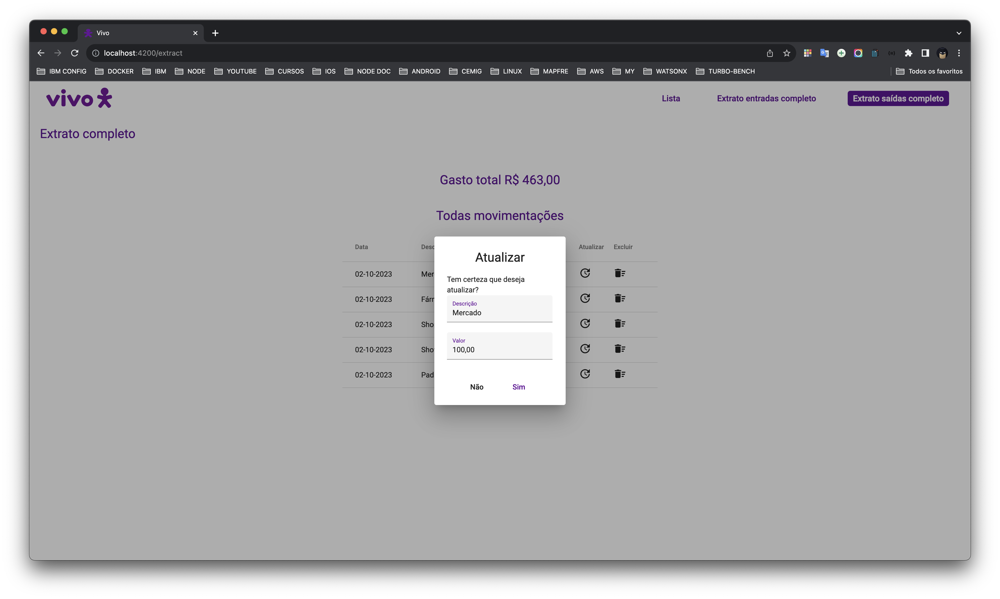

### Desenvolvimento
- O projeto é composto por dois componentes principais: uma API de backend, conhecida como BFF (Backend For Frontend), e uma interface gráfica que se conecta à API.
- O backend, ou [API](https://github.com/andersoncgiusti/vivo-api), serve como o cérebro da aplicação, gerenciando todos os dados e funcionalidades.
- A interface gráfica, [FRONT](https://github.com/andersoncgiusti/vivo-front), é a parte visível da aplicação, onde os usuários interagem com o sistema.

## Projeto
- O objetivo principal deste projeto é criar um sistema de controle de gastos pessoais. Os principais recursos incluem:
- Registro de saldos de entrada, permitindo que os usuários insiram o saldo inicial e adicionem novos saldos conforme necessário.
- Registro de despesas com descrição e valores, facilitando o acompanhamento de todos os gastos.
- Capacidade de editar e excluir entradas e saídas de saldo, proporcionando flexibilidade aos usuários para corrigir erros ou ajustar informações.
- Este sistema oferece uma maneira conveniente e eficaz de monitorar e gerenciar as finanças pessoais, ajudando os usuários a manter o controle de seus gastos e saldos de forma simples e intuitiva.

  
  
  
  
  
  
  
  
  
  

